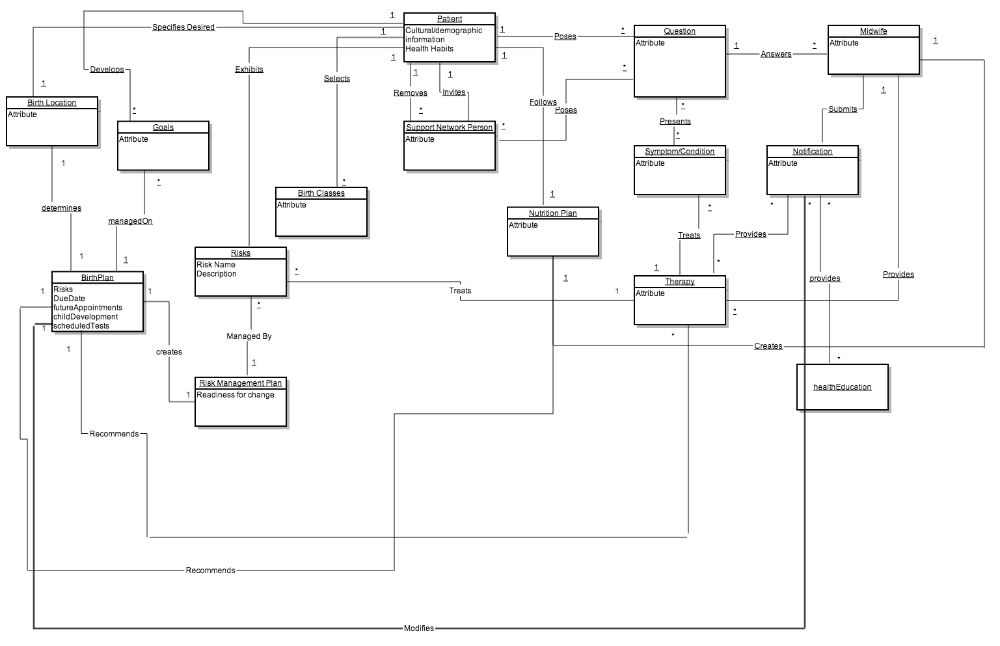
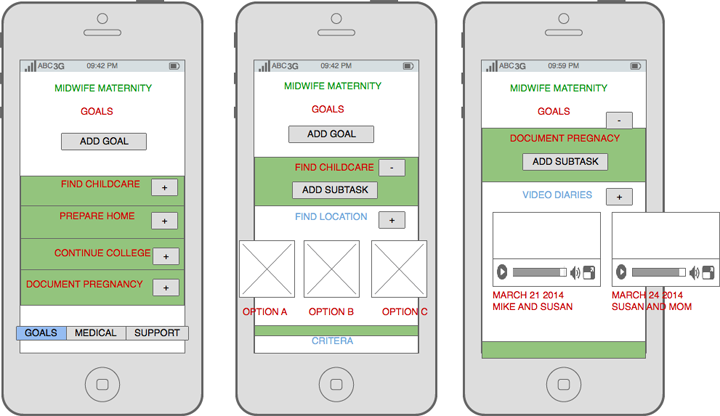

I've worked in design, writing, and technology my entire career.  Currently, in addition to my full-time job, I provide technology and design consulting for non-profits.  I designed a new web site for Little Elm Public Library recently, and am currently a technical consultant for Barbershop Books, a non-profit that connects young people to books.

## E-Commerce

I’ve developed information architecture; content strategy; and mobile designs for e-commerce brands, focused on hardware, pet supplies and organic food.

*For the organic food site for Yumza.com, I used research in e-commerce usability to redesign the product search and check-out experience; I also developed information architecture and content strategy for this and other e-commerce sites*

<a href="#" class="page__taxonomy-item" rel="tag">E-commerce</a>

<a href="#" class="page__taxonomy-item" rel="tag">UX Design</a>

## Financial Services

I’m currently working on an app for financial decision-making, and on design for an internal CRM system

<a href="#" class="page__taxonomy-item" rel="tag">Sketch</a>

<a href="#" class="page__taxonomy-item" rel="tag">Interface Design</a>

<a href="#" class="page__taxonomy-item" rel="tag">Prototyping</a>

## Open Source Software

I’ve redesigned a software system interface, designed a kids version of the software, and designed and developed features to enhance the software experience

*For the open-source software, Koha, I redesigned the interface to create a better design and improve the functionality. This design was widely adopted by clients, and led to the acquisition of new clients.  Additionally, I did a comprehensive accessibility study of the software interface using WebAim software and made the software accessible*

*I developed and designed a kids version of Koha.  This site allows kids to select books based on categories, most popular, and book series.  I created the back-end interface as well that allows librarians to define categories, and to add book lists for summer reading and other reading programs.*

<a href="#" class="page__taxonomy-item" rel="tag">Javascript</a>

<a href="#" class="page__taxonomy-item" rel="tag">JSON</a>

<a href="#" class="page__taxonomy-item" rel="tag">Interface design</a>

<a href="#" class="page__taxonomy-item" rel="tag">Accessibility</a>

<a href="#" class="page__taxonomy-item" rel="tag">Product Design</a>

## Thesis projects

*For my thesis project in design school at Philadelphia University, I designed and developed an app centered around midwifery and pregnancy.  This continued my interest in digital medicine (in a previous semester, I worked with an industrial design student to develop an interface for products designed for home healthcare).  For this project, I did user research with midwives, developed user flows and data models, and developed a prototype in Android, using parse.io for real-time data*

<a href="#" class="page__taxonomy-item" rel="tag">Java</a>

<a href="#" class="page__taxonomy-item" rel="tag">Android Development</a>

<a href="#" class="page__taxonomy-item" rel="tag">User Research</a>

<a href="#" class="page__taxonomy-item" rel="tag">Product Design</a>
